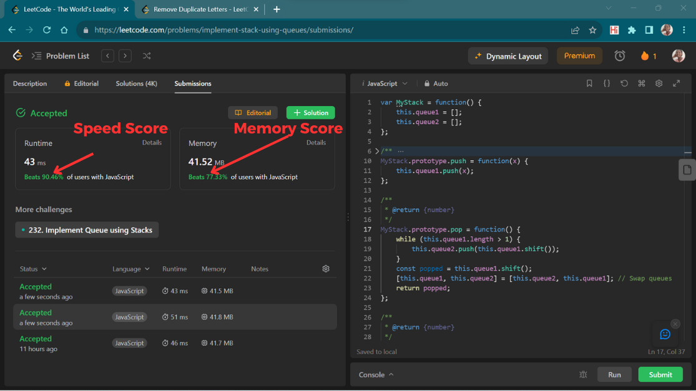
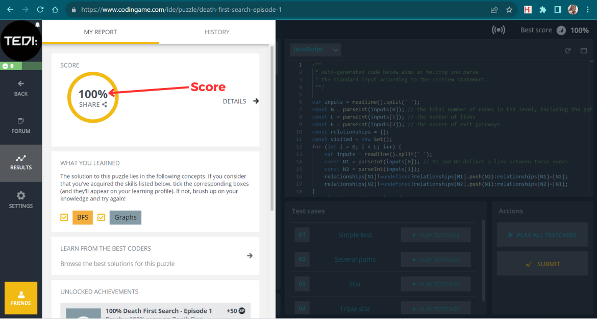

# Tenum Talks - Data Structures & Algorithms 📝

Tenum Talks are virtual engagement sessions by Techtenum. In this sessions, we learn, we code, we share experiences and grow our technical skills. This repository is dedicated to sharing resources, code and collaboration all related to Data Structures and Algorithms.

## Join our community 🚀

Our community is open for all to join in and contribute whichever way they feel capable. We are always happy to have new members and to see each other grow their tech skills.

Check out some learning resources shared by community members. And also feel free to share those you find helpful. [View Resources Here](./learning%20resources/RESOURCES.md)

## How to start contributing 🔥

To start contributing, please share your email address to admin@techtenum.com with the subject "Request to Contribute in Tenum Talks - DSA".

## Contribute ✨

Once added, you can now contribute!

Every contribution should be made as a separate branch and a merge request made. Ensure that there are no merge conflicts. The changes will then be approved and merged.

## start of file structure

- project root
  - Talk directory
    # Language directory
    - js
      - 'speedScore*memoryScore'*'github username (1)'.js
      - 'speedScore*memoryScore'*'github username (2)'.js
    - python
      - 'speedScore*memoryScore'*'github username (1)'.py
      - 'speedScore*memoryScore'*'github username (2)'.py
    - php
      - 'speedScore*memoryScore'*'github username (1)'.php
      - 'speedScore*memoryScore'*'github username (2)'.php

## i.e

- **Tenum-Talks---DSA** ## project root directory
  - **tenumTalk07** ## Talk directory
    - **26_removeDuplicatesFromSortedArray_leetcode** ## task root directory
      - **js** ## js root directory
        - [82_72_Ginger-Stone.js] ## js solutions (file name: 'github username'.js)
      - **python** ## python root directory
        - [90_50_emmanuelkens.py] ## python solutions (file name: 'github username'.js)

## end of file structure

## Why Speed Score and Memory Score?

The aim of us practicing DSA is to find the better approaches as to how we write code. Among the ways we measure this is by how fast the code runs and how much space it consumes.

Different sites measure and share with us how we performed. Whenever you submit you code, you will find it ranked, mostly in percentage of how you performed in comparison to others or how you performed in terms of test cases passed.

Just to make illustrate, here are two examples showing the scores we need to add.

For Leetcode, add both speedScore and memoryScore for example

> [90_60_Ginger-Stone.js] (_speedScore_: '90' and _memoryScore_: 60).
> ...**Always round up to avoid using decimals**.

### Leetcode Scores - _Annotated in red_

This file will now be named [91_78_Ginger-Stone.js] _speedScore_: '91' and _memoryScore_: 78.

### Codingame Scores - _Annotated in red_

This file will now be named [100_Ginger-Stone.js] Since score is defined as passing all test cases in Codingame, then we'll have our score as only the percentage.

